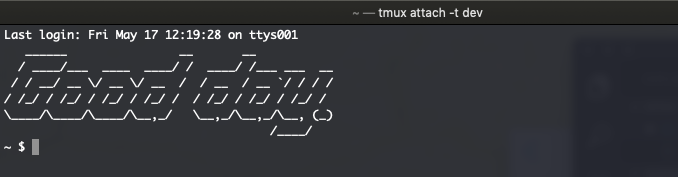

# Workspace

My best attempt at portable workspace settings when working across Linux & macOS devices.

Whenever practical, my preference is to work from the command line. These workspace settings
will reflect that goal of mine. I like to explore productivity benefits and pleasant working
conditions from the CLI.

## Dependencies

In order to copy / paste these settings, the following dependencies are required:

- [Figlet](http://www.figlet.org/)
  - For macOS, you can use [brew](https://formulae.brew.sh/formula/figlet) to install it.
  - I'm a fan of the [slant font](http://www.figlet.org/fontdb_example.cgi?font=slant.flf).
  - For example, `mkdir ~/.figlet && cd $_ && curl -O http://www.figlet.org/fonts/slant.flf`
  - Now you can reference that font, just as seen in my `.bash_profile`.
