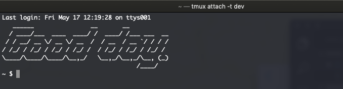
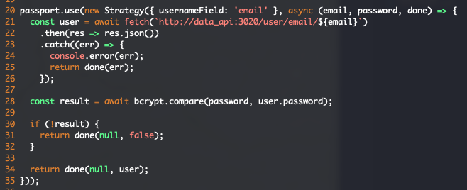
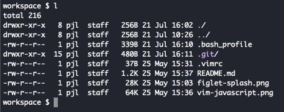
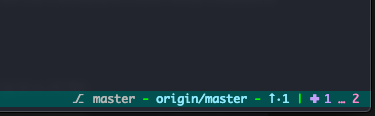

# Workspace

My best attempt at portable workspace settings when working across Linux & macOS devices.

Whenever practical, my preference is to work from the command line. These workspace settings
will reflect that goal of mine. I like to explore productivity benefits and pleasant working
conditions from the CLI.

## Dependencies

In order to copy / paste these settings, the following dependencies are required:

- [Figlet](http://www.figlet.org/)
  - For macOS, you can use [brew](https://formulae.brew.sh/formula/figlet) to install it.
  - I'm a fan of the [slant font](http://www.figlet.org/fontdb_example.cgi?font=slant.flf).
  - For example, `mkdir ~/.figlet && cd $_ && curl -O http://www.figlet.org/fonts/slant.flf`
  - Now you can reference that font, just as seen in my `.bash_profile`.
- [pathogen.vim](https://github.com/tpope/vim-pathogen)
  - Pathogen provides a Vim plugin manager. Thereafter, install the following:
  - [vim-sensible](https://github.com/tpope/vim-sensible)
    - Some sensible Vim settings to get you going.
  - [vim-javascript](https://github.com/pangloss/vim-javascript)
    - Nice syntax highlighting for JavaScript.
- `tree` command
  - Provides a readable directory output - really useful for documentation etc.
  - For macOS, you can use [brew](https://formulae.brew.sh/formula/tree) to install it.
- [tmux](https://github.com/tmux/tmux)
  - > tmux is a terminal multiplexer: it enables a number of terminals to be created, accessed, and controlled from a single screen.
  - For macOS, you can use [brew](https://formulae.brew.sh/formula/tmux) to install it.
  - `mkdir -p ~/.tmux/plugins && touch ~/.tmux.conf`.
  - [Tmux Plugin Manager](https://github.com/tmux-plugins/tpm).
    - This has almost been my one-stop-shop for tmux plugins.
    - Follow the installation instructions there.
    - Once installed, you can add your plugins to `~/.tmux.conf` then `prefix` + `I` to install,
      as per official instructions. Take a look at my own [tmux config](./.tmux.conf#L2-L6) for examples.
  - [Tmux Resurrect](https://github.com/tmux-plugins/tmux-resurrect)
    - > Restore tmux environment after system restart.
    - This is probably the staple tmux plugin for me.
    - Follow their official installation instructions (add to `~/.tmux.conf` then `prefix` + `I`).
  - [Tmux continuum](https://github.com/tmux-plugins/tmux-continuum)
    - This extends from Tmux Resurrect by auto saving your environment.
      A must have plugin for me.
    - Follow their official installation instructions (add to `~/.tmux.conf` then `prefix` + `I`).
  - [Tmux Yank](https://github.com/tmux-plugins/tmux-yank)
    - > Copy to the system clipboard in tmux.
    - This is one of those things you expect _just to work_, but one doesn't simply copy/paste without
    the help of this extra plugin! This plugin enables seemless copy/paste.
    - Note the official installation instructions depending on your OS. E.g. for macOS you often
      need `reattach-to-user-namespace`, which you can get from 
      [brew](https://formulae.brew.sh/formula/reattach-to-user-namespacehttps://formulae.brew.sh/formula/reattach-to-user-namespace). Anyway, it's all in the docs for this plugin.
  - [Tmux Prefix Highlight](https://github.com/tmux-plugins/tmux-prefix-highlight)
    - > Plugin that highlights when you press tmux prefix key.
    - This is a nice to have, but it's useful to see a visual indication of when the prefix key has
      been activated.
    - Follow their official installation instructions (add to `~/.tmux.conf` then `prefix` + `I`).
  - [Tmux Sensible](https://github.com/tmux-plugins/tmux-sensible)
    - Consider installing this. For the record, I haven't. My approach was to copy/paste the settings I
      specifically wanted. Although, you should probably install this unless you're an exceptionally
      fussy ~~control freak~~ person like me 😁
  - [Tmux GitBar](https://github.com/arl/tmux-gitbar)
    - Outside of the comforts of TPM, this plugin must be installed directly (at the time of writing).
    - Follow the official installation instructions. It involves cloning the repo and adding a line to
      your `~/tmux.conf`, [like so](./.tmux.conf#L10).
- [McFly](https://github.com/cantino/mcfly)
  - A smart and UI focused replacement for searching/executing commands in bash history (`ctrl-r`).
  - Follow the official installation instructions.

## Samples

The Vim JavaScript plugin applying some pleasant highlighting to a JS file:



Some human readable touches and colour output to my `ls` alias:



Example of `tree` output:

```
$ tree
.
├── README.md
└── screenshots
    ├── figlet-splash.png
    ├── ls-alias.png
    └── vim-javascript.png

1 directory, 4 files
```

Tmux GitBar in action:



---
